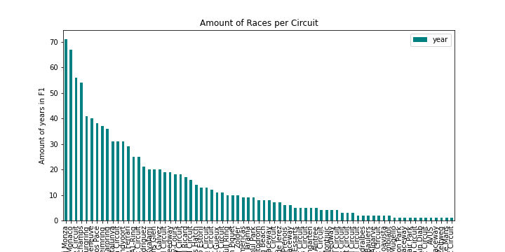

# Formula1_Fun
For this project, we were intersted in answering the following questions:

1) Who are the top 3 drivers for all time wins in recorded F1 history?
2) What is the frequency of which any circuit appeared in the history of formula 1 and which circuit has been featured the most across 1950 to 2021 formula 1 seasons.
3) Is there a significant difference between a driver's qualifying scores and race scores?

In order to answer these questions we required the following data:
- F1 drivers over the years
- A driver's rankings for each race
- A driver's ranking in a qualifying race
- All the races in each season
- The results of every race
- Circuits and which circuits were included in which season from 1950 to 2021

## Extract
While searching for the best way to extract this information (As it is contained on Wikipedia and to a certain extent on the official F1 page) we found a Kaggle data set with a number of .csv files containing way more information than needed.

We were able to directly download all the .csv files from [Kaggle](https://www.kaggle.com/sveneschlbeck/formula-1-ergast-developer-api-data(hyperlink)) and exported the following .csv files
- resources/data/circuits.csv
- resources/data/driver_standings.csv
- resources/data/drivers.csv
- resources/data/qualifying.csv
- resources/data/races.csv
- resources/data/results.csv
- resources/data/status.csv

We also scrapped Wikepida to pull a picture of the drivers. - see app/drivers_scrape.py for this.

## Transform
For our first question, Jon imported the driver data into postgresql and cleansed it on the import process by:
 - dealing with erroneous data and converting those values to null
 - converting the relevant data to the appropriate data types (ints, text, etc)
 - See sql/drivers_import_data.sql file.

 Further transfomations were done after the data was subsequently manipulated with pandas and joined/aggregated via sql alchemey. (see sql/drivers.ipynb and app/drivers_scrape.py)  It was then pumped into mongo where a flask app was used to render the mongo data along with scraped data from wikitpedia to
 render the final results to answer the question : Who are the top 3 drivers for all time wins in recorded F1 history? (see app/drivers_app.py)

Ben - imported the races.csv and circuits.csv files in to pandas (circuits.ipynb) and created dataframes. From there he checked the dataframes for null values. He then reduced the dataframes down the the important series that we wanted to keep. From there Ben created tables in pgadmin to properly import the dataframes to sql from pandas.

Serena imported the qualifying.csv into a jupyter notebook and set it up as a pandas dataframe. Using Pandas she cleaned the data. She also set up blank tables with the approparite columns to keep the data needed and set the data types, primary keys and foreing keys to join with the other tables made by Jon and Ben in her Postgres database to hold the dataframes.
- See sql/qualifying_schema.sql for schema and,
- sql/qualifying.ipynb for data cleaning.

## Load
Jon loaded finalized data into postgreSQL via the drivers_import_data.sql file that took care replacing erroneous data (\n's) and converting those to null as described in the Transform section above. Scripting the import allowed for quickly re-running the process to deal with any datatype mismatches etc. so getting the data put into tables with appropriate data types and linked as per the schema design (see drivers.md) was acheived quickly and accuratly.  Further transformation was done (joined/aggregated) and then loaded into mongo for use in the web app for visualising the results with only the data needed for this purpose.

Ben using SQL Alchemy loaded into tables of his db using the circuits.ipynb pandas file. Once the data was cleaned and sorted he pushed the data in to two seperate databases race_db and circuits_db.

Serena using SQL Alchemy loaded the cleaned data into tables of the db F1 Postgres db - See sql/qualifying.ipynb

## Analysis
 In order to answer our first question, Jon first used a jupyter notebook (drivers.ipynb) to quickly read the data that was loaded into postgreSQL. The data was then pulled into pandas to perform analysis via orm (sql alchemey) for joining and aggregating the data to answer the question:
Who are the top 3 drivers in F1 history based on number of wins?. Once the process to get the answer was discerned, he transferred this logic into the drivers_scrape.py app to be part of the process to visualise the final result.

Our Second question was to discover which circuits have been featured the most across the history of the F1 championship. We used SQL alchemey in the races_analysis.ipynb file to take the sql databases in to pandas. Then we used a group by function on circuit ID and merged the races and circuits dataframes to then determine the answer.
 Ben import graph
 

 Our third question was to see if there would be a significant difference between race standings positions comparare to race qualifying positions. Based on a paired samples t-test grouping based on driver, there was no significant difference. See analysis/qualifying_analysis.ipynb for work.
 
 ## Bonus
 Jon created a flask app to render the result out to a web page to show the total wins for the top 3 drivers along with their bio pic found on wikipedia. The neccessary code from the drivers.ipynb notebook was converted into a python app (app/drivers_app.py and app/drivers_scrape.py) that read the data from our newly minted Postgres database joined with the wikepieda images and flattened and stored in mongo (mongo data)  where it was then rendered back out via an html template formatted with bootstrap (/app/templates/index.html))

## Data:
- https://www.kaggle.com/sveneschlbeck/formula-1-ergast-developer-api-data
  - Contains information about: Drivers, races,
- Wikepedia (to be scraped and formatted with beautifulsoup)

## Database:
- PostgresSQL
- MongoDB

## Team Members:
<ul style="list-style:none">
<li>Serena Remtulla-Langlois</li>
<li>Ben Smith</li>
<li>Jon Wood</li>
</ul>
