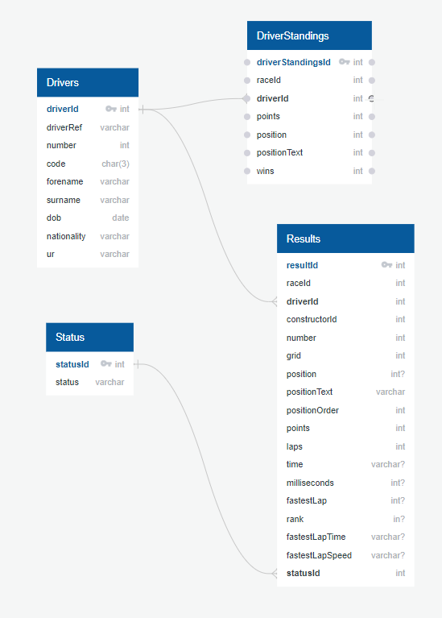

# Driver PostgreSQL Schema

# Notes on Import and Data Cleansing processes

Importing the data from the csv files into PostgreSQL was done to identify and aknowledge null values.  This was addressed in the drivers_import_data.sql file.

This also allowed for the data to be converted and stored in more usable data types for aggregation etc. (i.e. converting to ints and floats where applicable)

The data was then pulled into pandas using sql alchemey to perform analysis via orm for joining and aggregating the data to answer the questions:
<ul>
<li>Who was the winningest driver of all time?</li>
<li>How many wins did this driver have?</li>
<li>Who was the next most winningest driver behind them?</li>
</ul>

Once the data for this was found, it was flatened and stored in mongo along with a url to the driver's profile image from wikipedia

